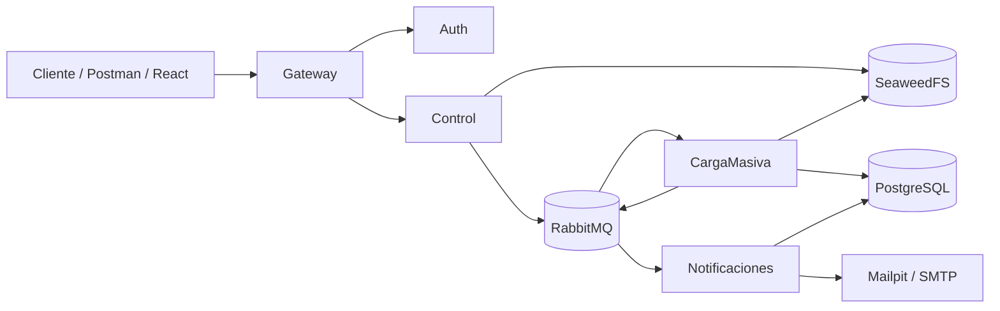

# Sistema de Carga Masiva Distribuida

> Reto técnico backend senior · .NET 10 · PostgreSQL · RabbitMQ · SeaweedFS · Docker Compose

Una solución distribuida para recibir archivos Excel, validarlos, procesarlos de forma asíncrona, persistir sus resultados y notificar el desenlace. El objetivo no es solo aceptar un archivo: deja un flujo observable, recuperable y defendible ante una revisión técnica.

**[Ver demo funcional (~5 min)](https://drive.google.com/file/d/1VGuuXTcuEjBK-6rf-VLUXAvVc3XzjMx4/view?usp=sharing)** · **[Enunciado original](docs/RETO-ORIGINAL.md)** · **[Pruebas de escala](docs/pruebas-de-escala.md)**

## Para quien revisa el repositorio

La manera más rápida de evaluarlo es:

1. Levantar el stack con `docker compose up -d --build --wait`.
2. Importar la colección de Postman y cargar el fixture.
3. Observar el estado, el correo en Mailpit y la topología en RabbitMQ.
4. Contrastar las decisiones con el diseño OpenSpec.

| Aspecto | Evidencia |
|---|---|
| Flujo completo: login, carga, proceso asíncrono, consulta y notificación | [Demo](https://drive.google.com/file/d/1VGuuXTcuEjBK-6rf-VLUXAvVc3XzjMx4/view?usp=sharing), [Postman](#probar-el-flujo), Mailpit y RabbitMQ |
| Responsabilidades y dirección de dependencias | [Arquitectura](#arquitectura-y-límites-de-dependencia) y guardia de arquitectura |
| Reglas del Excel | [Fixture de aceptación](#fixture-de-aceptación) y especificaciones |
| Arranque reproducible | [Puesta en marcha](#puesta-en-marcha) y `docker-compose.yml` |
| Decisiones discutibles del enunciado | [Diseño OpenSpec](openspec/changes/carga-masiva-microservicios/design.md) |
| Rendimiento medido y techo conocido | [Pruebas de escala](docs/pruebas-de-escala.md) |

## Qué resuelve

- Autentica usuarios y autoriza la carga por permiso.
- Recibe el Excel por el Gateway y lo conserva en almacenamiento de objetos.
- Acepta la solicitud rápido y desplaza el trabajo pesado a RabbitMQ.
- Procesa el archivo, aplica reglas de negocio y registra filas aceptadas y rechazadas.
- Expone historial, estado y detalle de errores sin bloquear al cliente durante el procesamiento.
- Envía la notificación final por correo, observable localmente con Mailpit.

## Fixture de aceptación

El archivo [samples/carga_masiva_productos.xlsx](samples/carga_masiva_productos.xlsx) produce un resultado determinista: **154 filas insertadas y 46 rechazadas**. Es la forma más corta de comprobar validación, persistencia, historial, detalle y notificación sin depender de datos externos.

## Arquitectura y límites de dependencia



| Componente | Responsabilidad |
|---|---|
| `Gateway` | Único borde HTTP público; enruta y aplica políticas de borde. |
| `Auth` | Emite credenciales y tokens. |
| `Control` | Recibe la carga, registra su intención y publica el comando. Es dueño de las migraciones. |
| `CargaMasiva` | Consume el comando, descarga el Excel, aplica reglas e inserta los resultados. |
| `Notificaciones` | Consume el evento de desenlace y envía el correo. |
| `BuildingBlocks` | Contratos y utilidades técnicas compartidas; no conoce Domain, Infrastructure ni hosts. |
| `Shared` | Elementos transversales compartidos, aislados de los Building Blocks de los servicios. |

Cada servicio aplica una separación hexagonal/Clean Architecture:

```text
Domain  ←  Application  ←  Infrastructure / Api
                    ↑
             contratos (puertos)
```

La regla es deliberada: **Domain no referencia Infrastructure**, Application depende de abstracciones y los adaptadores implementan esos puertos hacia afuera. Los hosts componen dependencias; no contienen reglas de negocio. Las pruebas de arquitectura convierten estos límites en una condición verificable, no en una convención escrita solamente.

La solución usa una instancia de PostgreSQL para el reto, con propiedad de escritura y esquema protegidos por servicio. No se presenta como una implementación de *database per service*: esa alternativa tendría costes de consistencia, migración y operación que no están justificados por el alcance actual. La decisión y sus consecuencias están documentadas en el [diseño](openspec/changes/carga-masiva-microservicios/design.md).

## Galería visual

Los diagramas están escritos en Mermaid para que GitHub los renderice al abrir
el repositorio; donde existe, el archivo Draw.io enlazado conserva la fuente
editable. La [guía visual completa](docs/explicacion/README.md) propone el
orden de lectura y explica qué evidencia aporta cada gráfico.

| Quiero entender… | Diagrama |
|---|---|
| Componentes, protocolos y borde público | [Arquitectura](docs/explicacion/01-arquitectura.md) |
| Camino feliz y rechazo de un archivo | [Flujo de carga](docs/explicacion/02-flujo-carga.md) |
| Estados y transiciones válidas | [Máquina de estados](docs/explicacion/03-maquina-estados.md) |
| Inversión de dependencias y responsabilidad de capas | [Dependencias DIP](docs/explicacion/04-dependencias-dip.md) |
| Entidades, propiedad de datos y consistencia | [Datos y propiedad](docs/explicacion/05-datos-y-propiedad.md) |
| Colas, TTL, reintentos y DLQ | [Mensajería](docs/explicacion/06-mensajeria-y-reintentos.md) |
| Login, JWT, permisos y cuotas | [Seguridad](docs/explicacion/07-seguridad-y-autorizacion.md) |
| Red Docker, puertos y health checks | [Despliegue](docs/explicacion/08-despliegue-local.md) |
| Capacidad medida y límite de 5M | [Escala y observabilidad](docs/explicacion/09-escala-y-observabilidad.md) |

## Puesta en marcha

### Requisitos

- Docker Desktop con Docker Compose v2.
- Puertos locales disponibles: `8080`, `1025`, `5432`, `5672`, `8025`, `8333`, `8888`, `9333` y `15672`.
- Para ejecutar pruebas desde el host: SDK de .NET compatible con la solución.

### Windows PowerShell

```powershell
Copy-Item .env.example .env
docker compose up -d --build --wait
docker compose ps
```

### macOS, Linux o Git Bash

```bash
cp .env.example .env
docker compose up -d --build --wait
docker compose ps
```

`--wait` devuelve el control solo cuando los servicios con health check alcanzan estado saludable. El stack esperado contiene nueve contenedores: Gateway, Auth, Control, CargaMasiva, Notificaciones, PostgreSQL, RabbitMQ, SeaweedFS y Mailpit.

| Recurso | Dirección | Uso |
|---|---|---|
| Gateway | http://localhost:8080 | Punto de entrada de la API. |
| Health del Gateway | http://localhost:8080/health | Comprobación rápida del borde público. |
| RabbitMQ Management | http://localhost:15672 | Colas, intercambios y reintentos. |
| Mailpit | http://localhost:8025 | Bandeja de correo local. |
| PostgreSQL | `localhost:5432` | Acceso local de desarrollo. |
| SeaweedFS | http://localhost:9333 | Servicio de almacenamiento local. |

En el primer arranque, Control prepara el esquema y Auth crea las cuentas de demostración definidas en el archivo `.env` local. Son credenciales de desarrollo: cámbielas antes de cualquier uso fuera de esta máquina.

### Comprobar salud desde CMD

```cmd
docker compose ps
for %S in (gateway auth control cargamasiva notificaciones) do @echo %S && docker compose exec -T %S curl -fsS http://localhost:8080/health
curl -i http://127.0.0.1:8080/health
```

Para inspeccionar un servicio durante una prueba:

```powershell
docker compose logs -f cargamasiva
docker compose logs -f control
docker compose logs -f notificaciones
```

> `docker compose down -v` detiene el stack y elimina los volúmenes locales, incluidos los datos de prueba. Úselo solo cuando quiera reiniciar el entorno.

## Probar el flujo

### Opción recomendada: Postman

Importe ambos archivos:

- [Colección Postman](postman/reto-carga-masiva.postman_collection.json)
- [Entorno local](postman/reto-local.postman_environment.json)

Seleccione el entorno local y ejecute primero **Auth → Login (admin)**. La colección guarda el token para las operaciones posteriores e incluye camino feliz y respuestas negativas de autenticación, autorización, validación y recurso inexistente.

El recorrido que conviene observar es:

1. Iniciar sesión como administrador.
2. Enviar `samples/carga_masiva_productos.xlsx` a `POST /cargas`.
3. Consultar `GET /cargas` hasta ver un estado terminal.
4. Consultar el detalle de la carga y sus errores.
5. Abrir Mailpit para comprobar la notificación.
6. Repetir con el usuario de consulta para comprobar la denegación por permiso.

### Opción por terminal

Las credenciales de demostración están en el `.env` local creado en el paso anterior. Con `curl` y `jq`:

```bash
TOKEN=$(curl -s -X POST http://localhost:8080/auth/login \
  -H "Content-Type: application/json" \
  -d '{"email":"admin@reto.local","password":"Reto2026!"}' | jq -r .accessToken)

curl -X POST http://localhost:8080/cargas \
  -H "Authorization: Bearer $TOKEN" \
  -F "archivo=@samples/carga_masiva_productos.xlsx"

curl http://localhost:8080/cargas \
  -H "Authorization: Bearer $TOKEN"
```

El procesamiento es asíncrono; el `POST` acepta la carga y la consulta de historial permite seguirla hasta que finalice, sea rechazada o falle.

### Cliente React opcional

El cliente de `frontend/` consume el Gateway y ofrece login, carga, historial y detalle. No replica reglas de negocio: el backend sigue siendo la fuente de verdad.

```bash
cd frontend
cp .env.example .env
npm install
npm run dev
```

Su contrato y alcance están descritos en la [especificación del cliente](openspec/changes/carga-masiva-microservicios/specs/frontend-cliente-react.md).

## Validación técnica

Ejecute las pruebas desde la raíz del repositorio una vez que Docker esté disponible:

```powershell
dotnet build Reto.slnx --no-restore --disable-build-servers -m:1 -p:UseSharedCompilation=false
dotnet test tests/Reto.Tests/Reto.Tests.csproj --no-build --no-restore --disable-build-servers -m:1
```

Las pruebas cubren reglas de negocio, contratos, persistencia, mensajería, almacenamiento y la guardia de arquitectura. La suite vigente —no un número histórico escrito en esta página— es la fuente de verdad para el total de pruebas y sus resultados.

## Rendimiento: evidencia y límite conocido

El proyecto incluye una medición real, no una estimación, con `samples/carga_masiva_2M.xlsx`:

| Escenario | Resultado observado | Interpretación correcta |
|---|---:|---|
| Inserción de 2 000 000 filas | `Finalizado` en **3 min 43 s** | La inserción set-based por lotes de 20 000 evita el timeout de un único `unnest` gigante. |
| Rechazo de 2 000 000 filas por períodos ya cargados | **44,813 filas/s** durante el procesamiento | Mide el camino de rechazo; no equivale a throughput de inserción. |
| Archivo de 5 000 000 filas en el equipo de prueba | OOM-loop | No es una capacidad soportada; requiere intervención manual para detener el consumidor y limpiar el mensaje. |

El lector Excel avanza hacia adelante, pero el caso de uso actual materializa colecciones para resolver reglas cruzadas. Por ello, el pipeline **no reclama memoria O(1)**. La carga de 2M es evidencia útil de funcionamiento en el equipo medido; no una garantía universal de capacidad.

Para ejecutar o interpretar estas pruebas con rigor —incluidos límites temporales de tamaño, condiciones de la base y cómo cortar el escenario de 5M— consulte [pruebas de escala](docs/pruebas-de-escala.md). No ejecute la prueba de 5M sin leer esa advertencia.

Una consecuencia operativa importante: para hacer polling use `GET /cargas`. El detalle de una carga con millones de errores solicita un total exacto y su coste es O(n) respecto de los errores de esa carga; es una consulta diagnóstica, no un endpoint de refresco frecuente.

## Decisiones que importan

| Decisión | Motivo | Consecuencia asumida |
|---|---|---|
| Mensajería asíncrona con RabbitMQ | La carga y el envío de correo no deben bloquear la respuesta HTTP. | El cliente consulta estado y el consumidor debe ser idempotente. |
| Reintentos, TTL y DLX | Un fallo transitorio no debe perder trabajo silenciosamente. | Los fallos persistentes quedan visibles y requieren diagnóstico. |
| Archivos en SeaweedFS | Evita transportar el binario completo por el broker. | La disponibilidad del objeto es parte del procesamiento. |
| Inserción por lotes con `unnest` | Reduce round trips y elimina el timeout observado a 2M en un único comando gigante. | El resto del pipeline sigue teniendo presión de memoria proporcional al archivo. |
| Un único punto público | Gateway concentra el borde HTTP y evita exponer los servicios internos. | Los servicios privados continúan aislados por la red de Compose. |
| Result / errores explícitos | Un resultado esperado no se expresa como excepción de control de flujo. | La API traduce el resultado a su contrato HTTP en el borde. |

El [documento de diseño](openspec/changes/carga-masiva-microservicios/design.md) conserva el razonamiento completo: contradicciones del enunciado, alternativas consideradas, decisión elegida y evidencia. Para la evolución transversal consulte también el [diseño hexagonal](openspec/changes/arquitectura-hexagonal-transversal/design.md).

## Seguridad y operación

- El Gateway es el único servicio de aplicación expuesto como puerto HTTP público.
- Los puertos de infraestructura publicados por Compose se enlazan a `127.0.0.1` para el entorno local.
- La autenticación usa tokens; la autorización de carga verifica un permiso, no solo la presencia de un usuario autenticado.
- El tamaño de archivo se valida en el borde y vuelve a comprobarse en el camino interno. El valor por defecto de entrega es **25 MB**.
- Correlation IDs acompañan las solicitudes para seguirlas a través de los servicios y los logs.
- Las variables de `.env` son configuración local. No convierta sus valores de ejemplo en secretos de producción.

## Mapa del repositorio

```text
src/
  BuildingBlocks/     contratos y utilidades técnicas reutilizables
  Gateway/            borde HTTP
  ServiceHost/        composición y arranque de servicios
  Services/           Auth, Control, CargaMasiva y Notificaciones
  Shared/             elementos transversales aislados
tests/Reto.Tests/     pruebas de integración, arquitectura y comportamiento
postman/              colección y entorno local
samples/              fixtures de aceptación y de escala regenerables
docs/                 enunciado, diagramas y mediciones
openspec/             decisiones y especificaciones de diseño
frontend/             cliente React opcional
```

## Documentación de apoyo

- [Contrato y arranque para agentes](AGENTS.md)
- [Evaluación transparente de agentes y práctica de entrevista](docs/evaluacion-agentes.md)
- [Enunciado original](docs/RETO-ORIGINAL.md)
- [Guía de diagramas para la defensa técnica](docs/explicacion/README.md)
- [Pruebas de escala y límites comprobados](docs/pruebas-de-escala.md)
- [Diseño de carga masiva](openspec/changes/carga-masiva-microservicios/design.md)
- [Diseño de arquitectura hexagonal transversal](openspec/changes/arquitectura-hexagonal-transversal/design.md)
- [Colección Postman](postman/reto-carga-masiva.postman_collection.json)

## Cierre

Este repositorio prioriza evidencia antes que marketing: el camino feliz se puede levantar y ejecutar; las reglas y límites de dependencia están protegidos por pruebas; y la capacidad observada, incluidos sus límites, se documenta con condiciones reproducibles. Esa combinación permite revisar el sistema como software operativo y no solo como una colección de diagramas.
