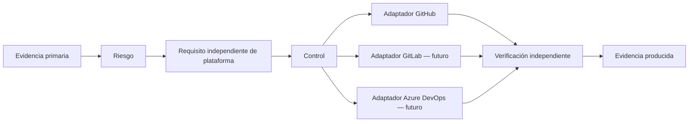

# Modelo conceptual de controles v0.1

## Principio rector

**ENGINEERING DECISION:** el núcleo describe qué riesgo se reduce y qué evidencia demuestra el resultado. Un adaptador expresa cómo una plataforma concreta intenta cumplirlo. La frase “usar GitHub Rulesets” nunca es un requisito conceptual.

## Entidades y términos

| Término | Definición operacional |
| --- | --- |
| Riesgo | Posibilidad de que una amenaza afecte un activo y su impacto asociado. |
| Requisito | Resultado de seguridad, integridad o gobernanza que debe conseguirse si aplica el perfil de riesgo. |
| Control | Salvaguarda verificable que intenta satisfacer un requisito. |
| Implementación | Configuración, proceso o automatización concreta que materializa un control. |
| Adaptador | Traducción de un control a una plataforma específica; es reemplazable. |
| Verificación | Prueba independiente que contrasta una implementación contra el requisito. |
| Evidencia | Registro inmutable o con retención definida que permite repetir la verificación. |
| Excepción | Aceptación temporal y explícita de riesgo residual; no una omisión silenciosa. |
| Dueño | Rol responsable de aceptar riesgo, mantener el control o revisar su evidencia. |

## Plantilla normativa de un control

Todo control del catálogo debe conservar esta cadena completa:

`evidencia fuente → riesgo → requisito → control → candidato de implementación → verificación → evidencia producida`.

Una configuración sin resultado de verificación tiene estado **implementación no demostrada**. Un workflow verde sin identidad de input, versión de control y salida conservada tiene evidencia insuficiente para el perfil alto.

## Perfiles de riesgo

| Perfil | Cuándo aplica | Diferenciación razonada |
| --- | --- | --- |
| Bajo | Cambio reversible, sin datos sensibles, sin privilegios productivos ni infraestructura. | Busca feedback rápido: revisión proporcional y verificación automatizada básica; no elimina trazabilidad ni análisis de secretos. |
| Medio | Cambio de funcionalidad, dependencia, contrato, persistencia o servicio con alcance limitado. | Añade revisión de pares, análisis de composición, artefacto identificable y plan de reversión. |
| Alto | Producción, identidad/autorización, datos sensibles, infraestructura, irreversibilidad, alto blast radius o impacto regulatorio. | Requiere separación de funciones, aprobación de environment, identidad efímera, evidencia de promoción y recuperación probada. |

**ASSUMPTION:** la clasificación inicial la propone quien cambia el sistema. **ENGINEERING DECISION propuesta:** el dueño de riesgo puede elevar el perfil, nunca rebajarlo sin registrar una excepción. Los umbrales concretos son **TBD-RISK-01**.

## Estados de un control

`propuesto → aprobado para implementar → implementado → verificado → monitorizado → retirado`.

El salto de “implementado” a “verificado” exige un caso de evaluación repetible. Ningún estado implica conformidad global con NIST, SLSA, DORA u OpenSSF.
