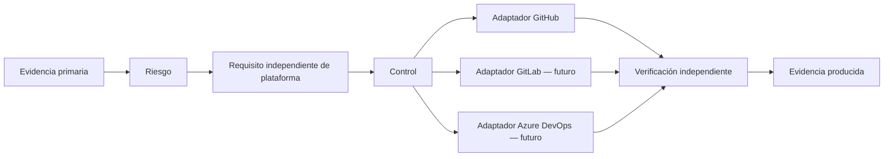

# Modelo conceptual de controles v0.1

## Principio rector

**ENGINEERING DECISION:** el núcleo describe qué riesgo se reduce y qué evidencia demuestra el resultado. Un adaptador expresa cómo una plataforma concreta intenta cumplirlo. La frase “usar GitHub Rulesets” nunca es un requisito conceptual.

## Entidades y términos

| Término | Definición operacional |
| --- | --- |
| Riesgo | Posibilidad de que una amenaza afecte un activo y su impacto asociado. |
| Requisito | Resultado de seguridad, integridad o gobernanza que debe conseguirse si aplica el perfil de riesgo. |
| Control | Salvaguarda verificable que intenta satisfacer un requisito. |
| Implementación | Configuración, proceso o automatización concreta que materializa un control. |
| Adaptador | Traducción de un control a una plataforma específica; es reemplazable. |
| Verificación | Prueba independiente que contrasta una implementación contra el requisito. |
| Evidencia | Registro inmutable o con retención definida que permite repetir la verificación. |
| Excepción | Aceptación temporal y explícita de riesgo residual; no una omisión silenciosa. |
| Dueño | Rol responsable de aceptar riesgo, mantener el control o revisar su evidencia. |
| Coste y fricción | Estimación cualitativa de implementación, operación recurrente, impacto al desarrollador y dependencia de plataforma. |

## Plantilla normativa de un control

Todo control del catálogo debe conservar esta cadena completa:

`evidencia fuente → riesgo → requisito → control → candidato de implementación → verificación → evidencia producida`.

Una configuración sin resultado de verificación tiene estado **implementación no demostrada**. Un workflow verde sin identidad de input, versión de control y salida conservada tiene evidencia insuficiente para el perfil alto.

El registro legible por máquina de cada control añade `cost_and_friction` con
`implementation`, `recurring`, `developer_experience` e
`infrastructure_platform_dependency`. Un coste alto no elimina un control
aplicable: obliga a que su dueño compare explícitamente el riesgo residual con la
alternativa, la excepción temporal o el cambio de alcance.

## Perfiles de riesgo

La clasificación se realiza con la [rúbrica v0.1](risk-classification.v0.1.md),
no por intuición del autor ni de un agente. Bajo significa un cambio reversible y
sin gatillos altos; medio añade superficie persistente o de servicio limitada; alto
incluye producción, IAM, secretos, datos sensibles, irreversibilidad o blast radius
amplio. La clasificación inicial no constituye aceptación de riesgo.

**ENGINEERING DECISION propuesta:** el dueño de riesgo puede elevar el perfil;
reducirlo requiere una excepción temporal y aprobada. Un agente no puede clasificar
ni aceptar riesgo como autoridad única. La rúbrica y los roles siguen sujetos a
aceptación humana en `TBD-RISK-01`.

## Estados de un control

`propuesto → aprobado para implementar → implementado → verificado → monitorizado → retirado`.

El salto de “implementado” a “verificado” exige un caso de evaluación repetible. Ningún estado implica conformidad global con NIST, SLSA, DORA u OpenSSF.
