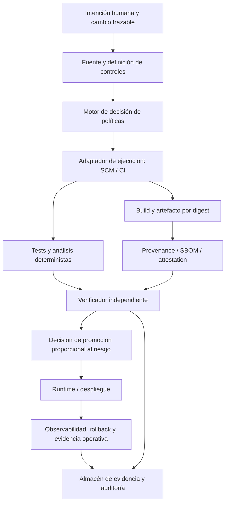

# Arquitectura de referencia de entrega segura v0.1

## Alcance

La arquitectura es una referencia para cualquier SCM/CI. GitHub es el primer adaptador candidato, no el modelo de control. Los componentes pueden ser documentos, APIs, pipelines, repositorios de evidencia o procesos humanos, siempre que mantengan sus contratos.

## Componentes lógicos

| Componente | Responsabilidad | No es responsable de |
| --- | --- | --- |
| Fuente e intención | Asociar cambio, propósito, aprobación y versión de control. | Declarar por sí solo que el cambio es seguro. |
| Modelo/catálogo de controles | Definir requisitos, perfiles, pruebas y evidencia esperada. | Ejecutar una plataforma concreta. |
| Adaptador de ejecución | Materializar controles aprobados en GitHub, GitLab u otro sistema. | Redefinir el requisito para que encaje con una limitación del proveedor. |
| Build y artefacto | Producir una salida identificada por digest y enlazada a sus inputs. | Autorizar producción. |
| Verificador independiente | Evaluar la evidencia y detectar violaciones/ausencias. | Generar y aprobar el mismo cambio material. |
| Decisión de promoción | Aplicar autorización humana/automática según perfil y política. | Ocultar excepciones o sustituir evidencia faltante. |
| Runtime/observabilidad | Ejecutar, medir, recuperar y emitir eventos de operación. | Reescribir la procedencia de un artefacto. |
| Evidencia | Conservar referencias, snapshots, resultados y retención. | Corregir retrospectivamente la ausencia de un control. |

## Contratos mínimos entre componentes

- El build recibe un commit inmutable y devuelve digest, logs, versión de definición y resultados.
- El verificador recibe evidencia con identidad, no etiquetas mutables como única referencia.
- La promoción recibe un digest, perfil de riesgo, estado de gates y aprobaciones; devuelve un registro de decisión.
- El runtime recibe la misma identidad de artefacto aprobada y emite health, versión, eventos de despliegue y recuperación.

**HYPOTHESIS:** este contrato permite adaptadores GitLab/Azure DevOps sin reescribir el catálogo. Se validará al diseñar un segundo adaptador, no se declara probado en v0.1.
