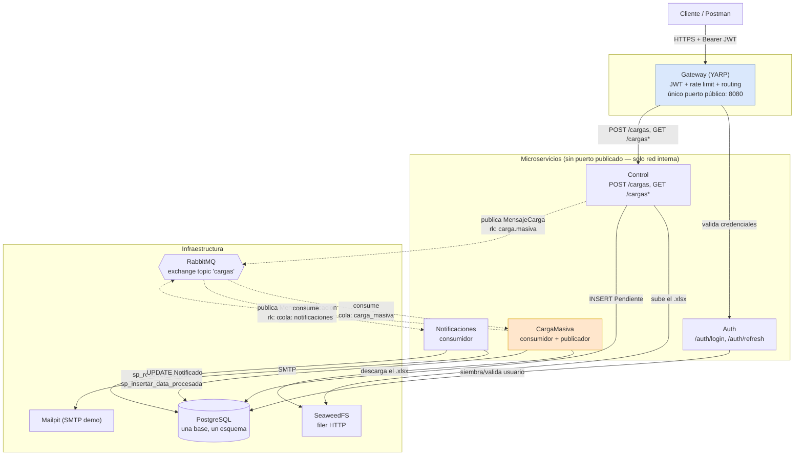

# Arquitectura — diagrama de componentes

Quién le habla a quién, y por qué protocolo. Flechas sólidas = HTTP síncrono;
flechas punteadas = mensaje asíncrono por RabbitMQ.

## Por qué el Gateway es el único punto público

Los 4 microservicios de negocio **no publican puerto** en `docker-compose.yml` —
solo son alcanzables dentro de la red de Docker. Si alguien intentara pegarle
directo a Control saltándose el Gateway, no podría: no hay puerto que tocar
desde el host. El Gateway valida el JWT una vez; Control lo vuelve a validar
igual (§3.2a), porque el usuario auditado sale del token, no de una cabecera
que cualquiera en la red interna podría inventar.

## Por qué Control y CargaMasiva no se llaman directo

No hay ninguna llamada HTTP entre Control y CargaMasiva. Todo el acoplamiento
es a través de RabbitMQ — Control no sabe si CargaMasiva está vivo, ocupado, o
caído en ese momento; solo publica y sigue. Es lo que hace que la subida
(`POST /cargas`) responda en milisegundos aunque el archivo tarde segundos en
procesarse: el procesamiento es asíncrono por diseño, no por optimización.

## Preguntas que esto responde

- *"¿Por qué no hay una llamada REST de Control a CargaMasiva?"* — porque el
  desacople es el punto: si CargaMasiva está caído, la carga queda en
  `Pendiente` esperando en la cola, no falla la subida.
- *"¿Cómo se protege Postgres de que cualquier servicio escriba cualquier
  cosa?"* — no hay aislamiento físico (una sola base, por el diagrama del
  enunciado, C10), pero sí propiedad de escritura declarada por tabla
  (`db-schema.md`) y respetada por disciplina de código.
- *"¿Qué pasa si el Gateway se cae?"* — todo el sistema queda inalcanzable
  desde afuera; es el único punto de falla del borde, a cambio de centralizar
  JWT y rate limiting en un solo lugar en vez de duplicarlo en 4 servicios.
