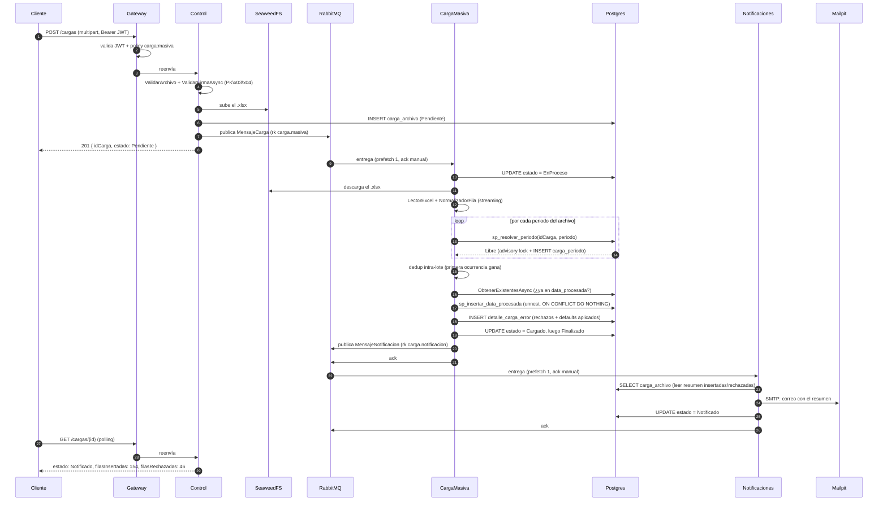
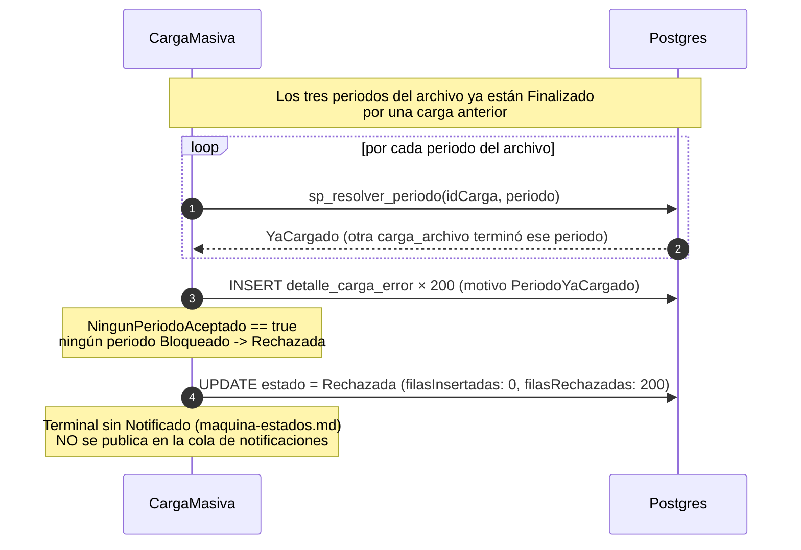

# Flujo de una carga — de punta a punta

Dos secuencias: el camino feliz (periodo libre) y el rechazo (mismo periodo
dos veces). Son el mismo código — lo que cambia es lo que devuelve
`sp_resolver_periodo`.

## Camino feliz

## Camino de rechazo (mismo periodo, segunda vez)

Mismo diagrama hasta el paso 14 — cambia lo que devuelve el SP:

## El mismo rechazo a escala: 2 millones de filas

El diagrama anterior usa el fixture de 200 filas para hacer visible la regla.
La misma transición se verificó con `carga_masiva_2M.xlsx` contra períodos que
ya estaban finalizados: las **2,000,000** filas terminaron con
`PeriodoYaCargado`, se auditaron como **2,000,000** registros y la carga pasó
a `Rechazada` sin publicar una notificación.

La medición separó los dos tramos para no mezclar transporte y trabajo de
negocio:

| Tramo | Resultado |
|---|---:|
| `POST /cargas` hasta `201 Created` | 6.211525 s |
| `fechaRegistro` hasta `fechaFin` de CargaMasiva | 44.630308 s |
| Tasa de este camino de rechazo | 44,813 filas/s |

Este resultado **no** es throughput de inserción: ningún período fue libre,
por lo que no se llamó al insert set-based. Sí confirma el coste y la
trazabilidad del rechazo masivo. También expuso una consecuencia del contrato
de detalle: pedir `GET /cargas/{id}?limiteErrores=1` superó 60 s porque la API
calcula `totalErrores` exacto antes de devolver la página limitada. Para polling
se debe usar el historial resumido; el detalle es una consulta puntual. La
evidencia, condiciones y procedimiento reproducible están en
[`../pruebas-de-escala.md`](../pruebas-de-escala.md).

## Puntos que suelen preguntar

- **¿Por qué Control no valida el periodo, si es quien recibe la subida?**
  Porque el periodo vive *dentro* del Excel, y Control no lo parsea (el
  diagrama del enunciado confirma que Control solo sube a SeaweedFS y
  publica). La validación tiene que vivir donde el archivo ya se leyó — en
  CargaMasiva.
- **¿Por qué el SP usa `pg_advisory_xact_lock` y no un `SELECT` antes del
  `INSERT`?** Un `SELECT` seguido de un `INSERT` es un TOCTOU: dos cargas del
  mismo periodo, llegando casi a la vez, verían ambas "libre" antes de que
  ninguna reserve. El advisory lock serializa a nivel de motor, dentro de la
  misma transacción del SP.
- **¿Qué pasa si CargaMasiva se cae a mitad de procesar?** El mensaje no se
  confirmó (`ack`) — RabbitMQ lo redelivera cuando el consumidor vuelve. El
  reproceso es seguro porque la clave de negocio `(Periodo, CodigoProducto)`
  con `ON CONFLICT DO NOTHING` hace que reinsertar lo ya insertado sea
  inofensivo (Idempotent Consumer, Richardson).
- **¿Por qué la carga rechazada no manda correo?** El enunciado solo define
  `Finalizado → Notificado` en la máquina de estados; `Rechazada`/`Bloqueada`
  son terminales sin salida. Se respeta tal cual, aunque es un hueco de UX
  real — nombrado en el README como trade-off, no escondido.
