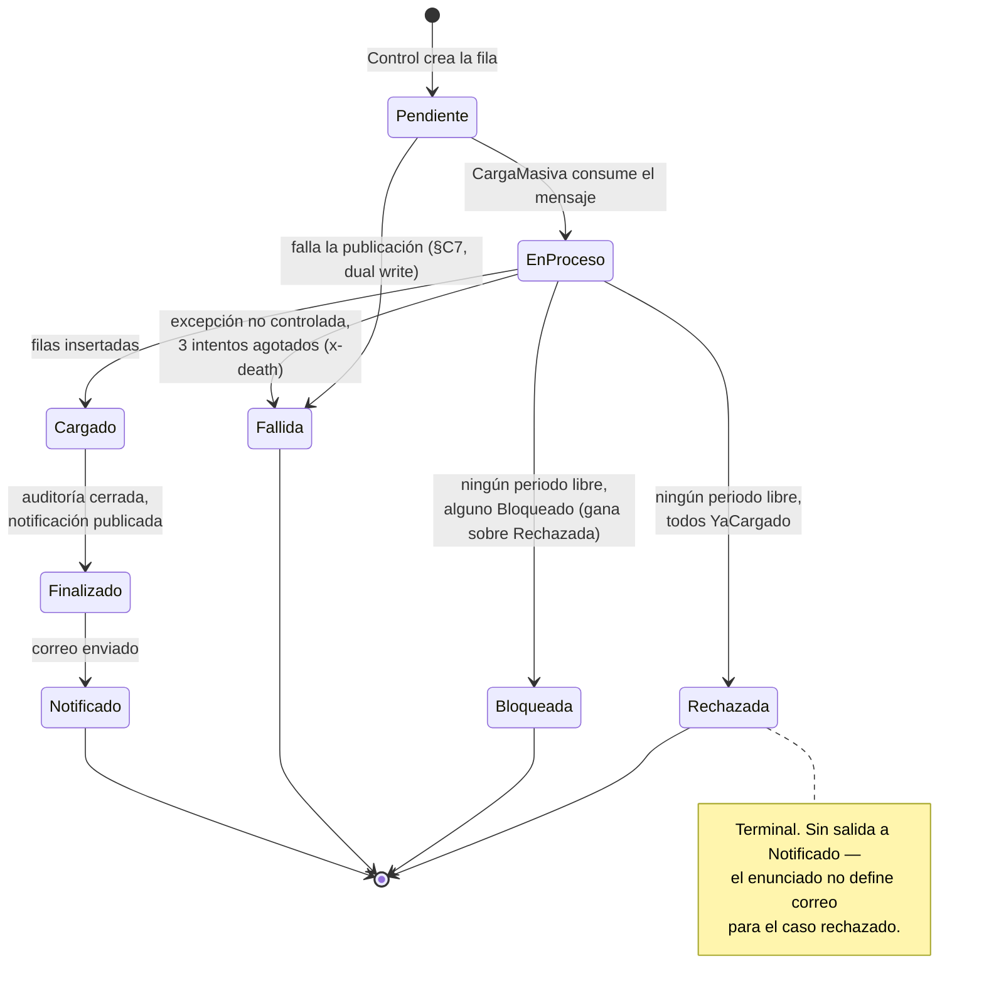

# Máquina de estados

El enunciado enumera 5 estados pero exige comportamientos (*"rechazada"*,
*"bloqueada"*, *"fallidos"*) que no tenían estado. Se completan a 8, con
transiciones cerradas — cualquier otro par lanza excepción de dominio
(`TransicionInvalidaException`).

## Por qué existen 3 estados terminales además de `Notificado`

| Estado | Quién lo escribe | Por qué es distinto de los otros dos |
|---|---|---|
| `Rechazada` | CargaMasiva | Hubo trabajo (se leyó el archivo), pero **cero** filas útiles — todos los periodos ya estaban cerrados |
| `Bloqueada` | CargaMasiva | Mismo caso, pero al menos un periodo tiene *otra carga en curso* — es temporal, reintentable |
| `Fallida` | Control o CargaMasiva | Error técnico, no de negocio — archivo ilegible, cola caída, reintentos agotados |

Separarlos importa porque cada uno responde una pregunta distinta si alguien
audita: *"¿el dato ya existía?"* (Rechazada) vs. *"¿hay una carga compitiendo
ahora mismo?"* (Bloqueada) vs. *"¿algo se rompió que no es culpa del
archivo?"* (Fallida).

## El caso no resuelto por el enunciado: mezcla de YaCargado y Bloqueado

Si un archivo trae 3 periodos y, digamos, 2 ya están `Finalizado` (YaCargado)
y 1 tiene otra carga `EnProceso` (Bloqueado) — ¿la carga completa termina
`Rechazada` o `Bloqueada`? El enunciado no lo dice. Se resolvió a favor de
`Bloqueada`: es la lectura más accionable (*"reintentá en un rato"* es más
útil que *"ya no hay nada que hacer"*) — documentado en
`specs/maquina-estados.md` como un escenario más, con la misma disciplina que
las contradicciones C1-C16.

## Preguntas que esto responde

- **¿Por qué `Cargado` y `Finalizado` son estados distintos si pasan casi
  seguidos?** El enunciado los pide explícitamente como dos pasos separados
  (§2.5e) aunque el flujo narrado (§3️⃣) solo menciona uno — se implementan
  los dos porque la lista de responsabilidades es más específica que la
  narrativa (contradicción D2, matriz-requisitos.md).
- **¿Se puede saltar un estado?** No — `MaquinaEstados.Validar` lanza si se
  intenta. No hay `Pendiente → Finalizado` directo, por ejemplo.
- **¿Qué prueba que las transiciones son realmente cerradas?** Un test
  recorre el producto cartesiano de los 8 estados × 8 estados y afirma que
  *solo* los pares listados arriba son válidos — no una muestra, todos.
