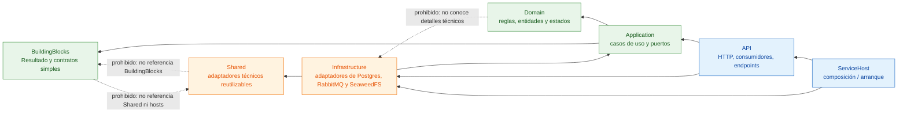
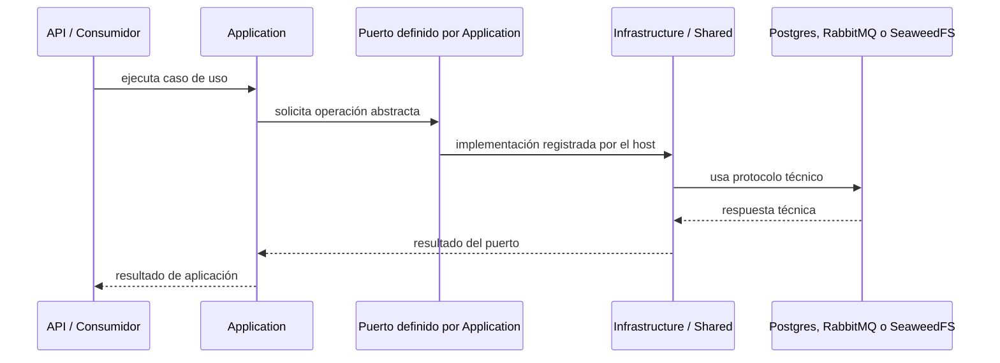

# Dependencias por capa — DIP verificable

**Pregunta que responde:** ¿qué puede conocer cada capa y qué impide que el dominio termine acoplado a PostgreSQL, RabbitMQ o HTTP?

Este diagrama representa referencias de proyecto permitidas; no el recorrido de una solicitud en ejecución.

Las líneas punteadas rojas conceptuales no son dependencias existentes: declaran relaciones que el diseño prohíbe. La dirección relevante de una flecha sólida es la de la referencia de compilación o de la composición, no la de una llamada HTTP.

## Regla práctica

| Elemento | Puede depender de | No debe depender de |
|---|---|---|
| Domain | Sus propias reglas y tipos de negocio | Infrastructure, API, EF Core, RabbitMQ, SeaweedFS |
| Application | Domain y contratos mínimos | Implementaciones concretas de adaptadores |
| Infrastructure | Application, Shared y librerías técnicas | Reglas de negocio del host |
| API | Application e Infrastructure para composición | Lógica de negocio duplicada |
| ServiceHost | APIs e infraestructura para registrar dependencias | Reglas de negocio |
| Shared | Dependencias técnicas propias | BuildingBlocks y capas de un servicio |
| BuildingBlocks | BCL y contratos simples | Shared, hosts, frameworks y servicios |

## Cómo se aplica al flujo real

El caso de uso no construye un cliente de RabbitMQ ni usa `RetoDbContext` directamente; declara lo que necesita mediante un puerto. El host decide qué adaptador concreto se registra.

## Qué evita una regresión

La guardia de arquitectura comprueba, entre otros límites, que:

- `Shared/Mensajeria` no tenga una referencia a `BuildingBlocks`.
- `BuildingBlocks` no declare `FrameworkReference` ni `PackageReference`.
- El núcleo de los servicios no incorpore frameworks técnicos.

La prueba está en [GuardiaArquitecturaTests.cs](../../tests/Reto.Tests/GuardiaArquitecturaTests.cs). El razonamiento completo y los puertos extraídos están en el [diseño hexagonal transversal](../../openspec/changes/arquitectura-hexagonal-transversal/design.md).

> DIP no significa una interfaz por cada clase. Aquí se introducen puertos en los límites donde existe una variación técnica real: persistencia, almacenamiento, publicación y autenticación.
