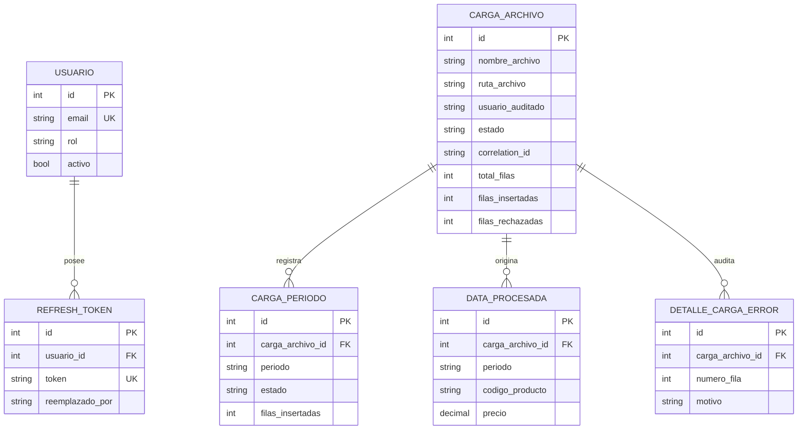
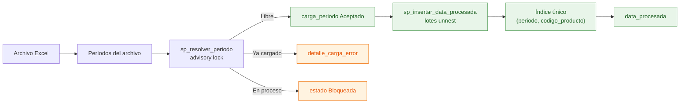

# Modelo de datos y responsabilidad de escritura

**Pregunta que responde:** si se usa una sola base para el reto, ¿qué datos existen, quién los modifica y cómo se protege la consistencia?

## Propiedad por ciclo de vida

| Datos | Autoridad de escritura | Uso |
|---|---|---|
| `usuario` y `refresh_token` | Auth | Login, emisión y rotación de credenciales. |
| `carga_archivo` al crearla | Control | Registra la intención, la ruta del archivo y el usuario auditado. |
| `carga_archivo` durante el proceso | CargaMasiva | Actualiza estados, contadores y errores de procesamiento. |
| `carga_archivo` al notificar | Notificaciones | Cierra `Finalizado → Notificado` después del correo. |
| `carga_periodo`, `data_procesada` y `detalle_carga_error` | CargaMasiva | Reserva períodos, persiste datos aceptados y deja auditoría por fila. |

`carga_archivo.usuario` es una instantánea de auditoría y no una clave foránea hacia `usuario`. Por eso no hay una línea entre esas dos entidades en el diagrama: el historial debe conservar quién inició la carga aunque el usuario cambie después.

## Consistencia que importa

- El `advisory lock` evita la carrera entre dos cargas que intentan reservar el mismo período.
- El índice único `(periodo, codigo_producto)` es también la llave de idempotencia: una reentrega no duplica datos ya insertados.
- El conteo de errores exacto puede ser costoso para millones de filas; el historial resumido es el endpoint apropiado para polling.

Cada servicio materializa sólo su vista de persistencia: [AuthDbContext](../../src/Services/Auth/Auth.Api/Infrastructure/AuthDbContext.cs), [ControlDbContext](../../src/Services/Control/Control.Api/Infrastructure/ControlDbContext.cs), [CargaMasivaDbContext](../../src/Services/CargaMasiva/CargaMasiva.Infrastructure/CargaMasivaDbContext.cs) y [NotificacionesDbContext](../../src/Services/Notificaciones/Notificaciones.Api/Infrastructure/NotificacionesDbContext.cs). El esquema compartido lo aplica una vez [DatabaseMigrator](../../src/DatabaseMigrator/Program.cs); ningún servicio de negocio migra la base ni conoce el contexto de otro.
