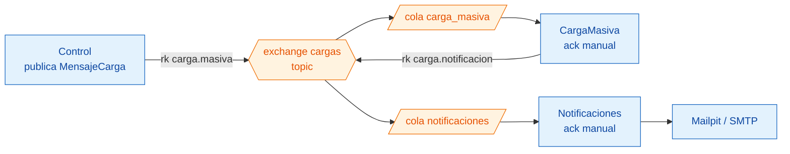
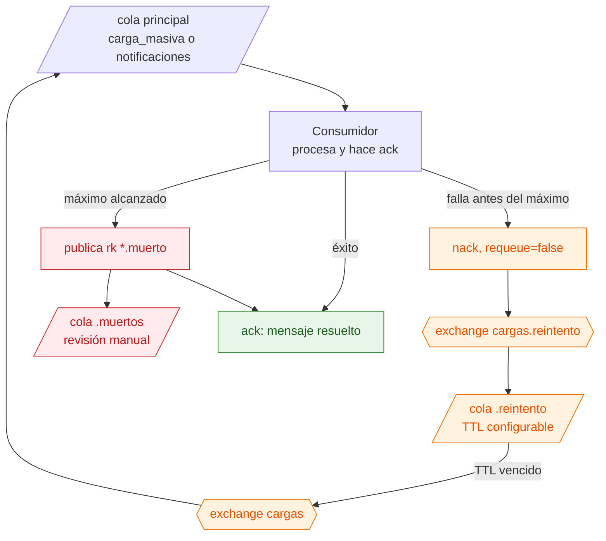

# Mensajería, reintentos y cola de muertos

**Pregunta que responde:** ¿cómo viaja el trabajo entre servicios y qué ocurre exactamente cuando un consumidor falla?

## Topología normal

Los contratos de mensaje son pequeños: se publica la referencia de la carga y del archivo, no el binario Excel. El archivo vive en SeaweedFS; RabbitMQ transporta la orden de procesarlo y conserva el `CorrelationId`.

## Recorrido ante un fallo transitorio

El consumidor lee `x-death` para contar los intentos de su propia cola. Antes del máximo, el `nack` conduce al ciclo de TTL; al alcanzarlo, publica explícitamente en `*.muertos`, marca la carga fallida cuando corresponde y confirma la entrega original. Así se evita un ciclo infinito de reintentos de aplicación.

## Garantía y límite

| Aspecto | Comportamiento |
|---|---|
| Entrega | *At least once*: una entrega puede repetirse si el proceso cae antes del `ack`. |
| Idempotencia de datos | La clave única de negocio y `ON CONFLICT DO NOTHING` toleran el reproceso de filas ya insertadas. |
| Idempotencia de carga terminal | Una reentrega que llega cuando la carga ya está resuelta se ignora. |
| Fallo permanente | El mensaje queda en la cola de muertos para diagnóstico; no desaparece silenciosamente. |
| Límite conocido | Un OOM-kill puede matar el proceso antes de que el consumidor cuente el intento de aplicación; ese escenario de 5M está documentado como no soportado. |

Los nombres del protocolo están en [TopologiaMensajeria.cs](../../src/BuildingBlocks/TopologiaMensajeria.cs): es un contrato puro, sin cliente RabbitMQ. Cada servicio declara la topología mediante su propio adaptador ([CargaMasiva](../../src/Services/CargaMasiva/CargaMasiva.Infrastructure/TopologiaRabbit.cs), [Control](../../src/Services/Control/Control.Api/TopologiaRabbit.cs) y [Notificaciones](../../src/Services/Notificaciones/Notificaciones.Api/TopologiaRabbit.cs)), de modo que ninguno depende del arranque ni del ensamblado de otro. Para ver la incidencia real de 5M y por qué no se disfraza como éxito, consulte [pruebas de escala](../pruebas-de-escala.md).
