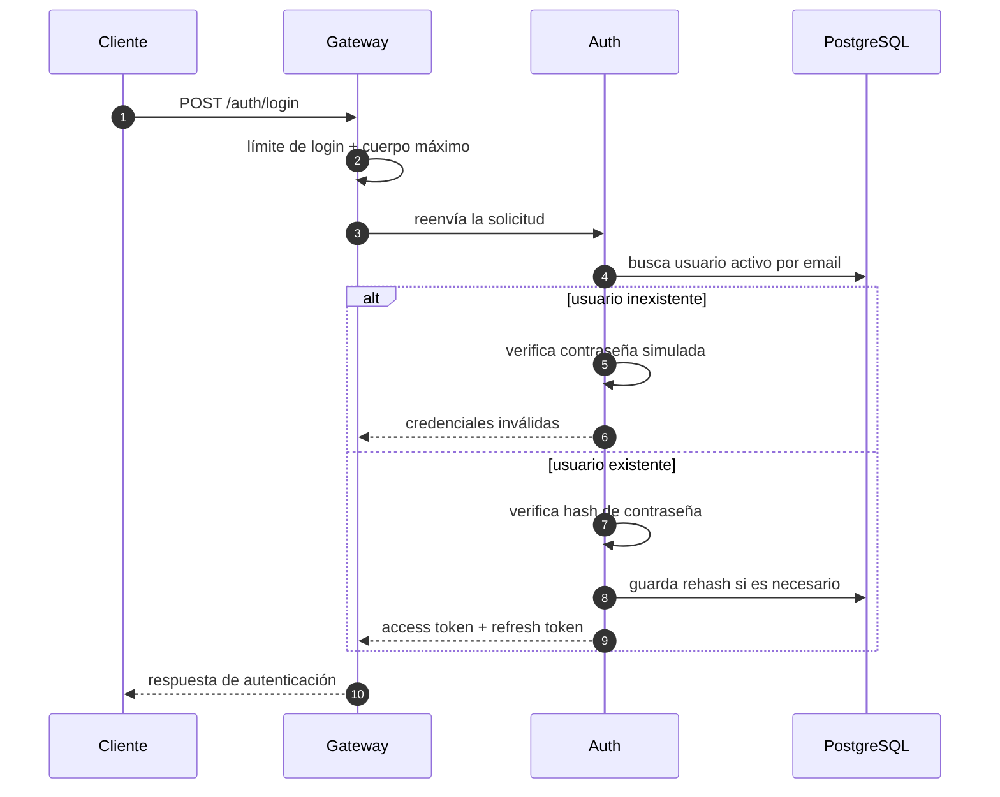
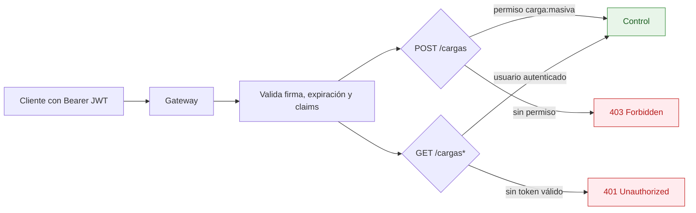
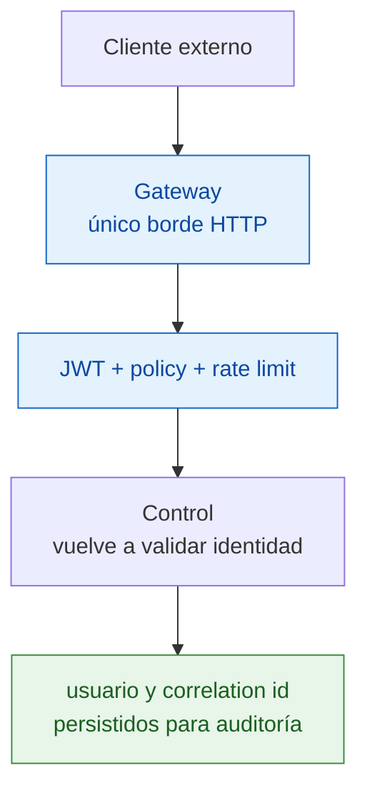

# Seguridad: autenticación, permisos y borde público

**Pregunta que responde:** ¿cómo se autentica a una persona, qué diferencia hay entre consultar y cargar, y por qué no basta con confiar en una cabecera interna?

## Inicio de sesión y token

Auth no distingue al cliente si falló el email o la contraseña. Esa decisión reduce la señal disponible para enumerar usuarios. Los tokens de refresco se almacenan y rotan; el acceso posterior se realiza con el token firmado, no con una identidad enviada libremente por el cliente.

## Autorización de rutas

Subir y consultar no comparten la misma política:

| Ruta | Requisito | Cuota | Motivo |
|---|---|---|---|
| `POST /cargas` | Token válido y permiso `carga:masiva` | Límite de carga | Es una operación de escritura y transporte de archivo. |
| `GET /cargas...` | Usuario autenticado | Límite general por usuario | Permite polling e historial sin entregar privilegio de carga. |
| `POST /auth/login` y `/auth/refresh` | No requiere Bearer previo | Límite de login | El cuerpo se limita de forma independiente del archivo. |

## Defensa en profundidad

El Gateway centraliza el borde, pero Control vuelve a validar el contexto que utilizará para auditar. La identidad auditada proviene de claims validados, no de una cabecera que un servicio interno pudiera fabricar.

Las rutas y las políticas se definen en [Gateway/Program.cs](../../src/Gateway/Program.cs); el caso de autenticación está en [ServicioAutenticacion.cs](../../src/Services/Auth/Auth.Api/Application/ServicioAutenticacion.cs).
