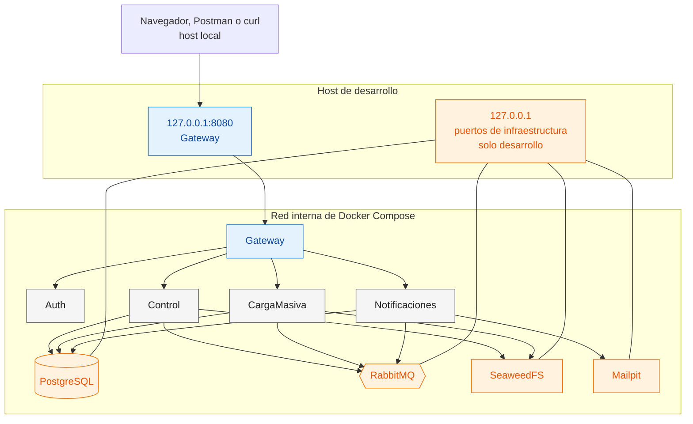
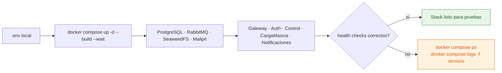

# Despliegue local con Docker Compose

**Pregunta que responde:** ¿qué se expone al host, qué queda dentro de la red Docker y cómo se comprueba que el entorno está listo?



Los microservicios de negocio no publican un puerto propio hacia el host. El Gateway es el borde HTTP de aplicación; los puertos de infraestructura se enlazan a `127.0.0.1` para facilitar diagnóstico local sin exponerlos a la red externa.

## Secuencia de arranque



## Puertos de interés

| Recurso | Dirección local | Propósito |
|---|---|---|
| Gateway | http://localhost:8080 | API y `/health`. |
| RabbitMQ Management | http://localhost:15672 | Topología, mensajes y DLQ. |
| Mailpit | http://localhost:8025 | Ver los correos enviados. |
| PostgreSQL | `localhost:5432` | Diagnóstico local. |
| RabbitMQ AMQP | `localhost:5672` | Diagnóstico de mensajería local. |
| SeaweedFS | `localhost:8333`, `8888`, `9333` | Diagnóstico del almacenamiento local. |

El compose define health checks para los nueve contenedores. La comprobación reproducible es:

```cmd
docker compose up -d --build --wait
docker compose ps
for %S in (gateway auth control cargamasiva notificaciones) do @echo %S && docker compose exec -T %S curl -fsS http://localhost:8080/health
```

La definición ejecutable está en [docker-compose.yml](../../docker-compose.yml). Para borrar datos locales de manera intencional use `docker compose down -v`; esa operación elimina volúmenes.
