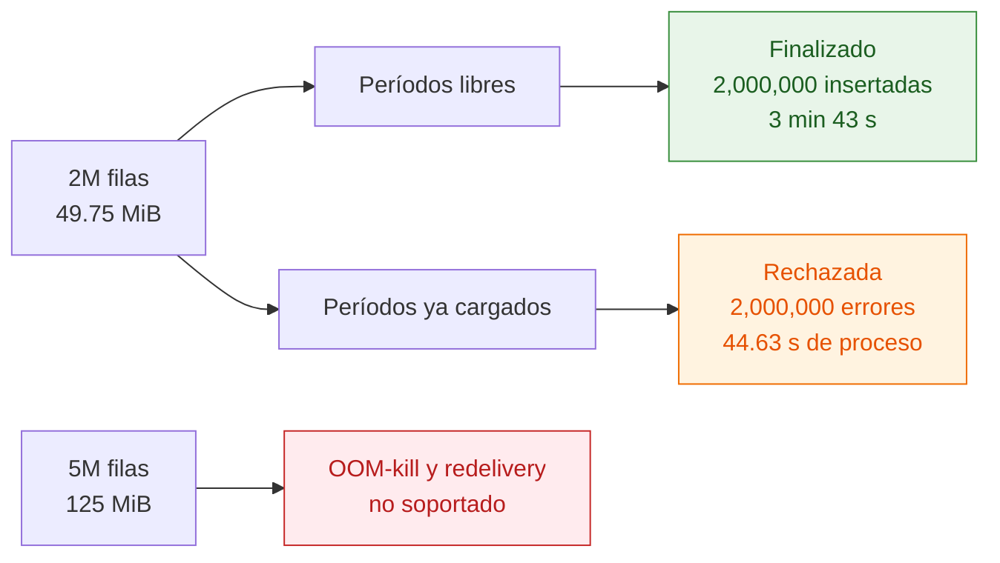
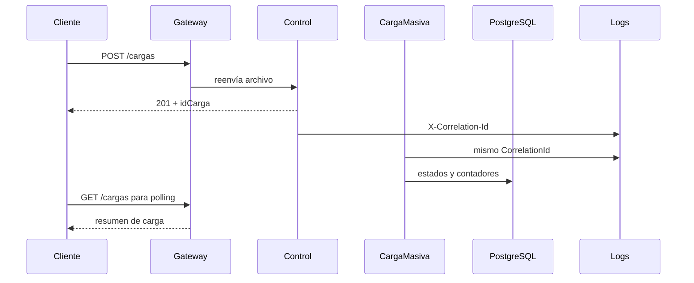

# Escala, límites medidos y observabilidad

**Pregunta que responde:** ¿qué volumen se comprobó de verdad, qué camino se midió y dónde está el límite actual?

## Lectura correcta de las métricas

| Escenario | Resultado | Qué demuestra | Qué no demuestra |
|---|---:|---|---|
| 2M, períodos libres | `Finalizado` en **3 min 43 s** | El insert por lotes de 20,000 filas termina en este equipo. | Memoria constante o capacidad universal. |
| 2M, períodos ya cargados | **44,813 filas/s** de proceso | Rechazo y auditoría de 2M filas sin insertar datos. | Throughput de inserción. |
| 5M | OOM-loop | El pipeline materializa datos y necesita intervención cuando el contenedor muere. | Una capacidad soportada. |

La carga de 2M exitosa redujo el problema de timeout de PostgreSQL al insertar con `unnest` por lotes. No convirtió el proceso completo en streaming: `ManejadorCarga` materializa las filas y `ProcesadorLote` trabaja con colecciones para resolver reglas cruzadas. Por eso la capacidad depende de la memoria disponible.

## Qué observar en una ejecución

Para polling utilice `GET /cargas`, que consulta el resumen. El detalle de una carga con millones de errores necesita calcular `totalErrores` exacto y puede tardar más de un minuto aunque se solicite una página pequeña.

La medición completa, condiciones temporales de configuración, consumo observado y procedimiento para detener el incidente de 5M están en [pruebas de escala](../pruebas-de-escala.md). Es la fuente de verdad de estas cifras.
